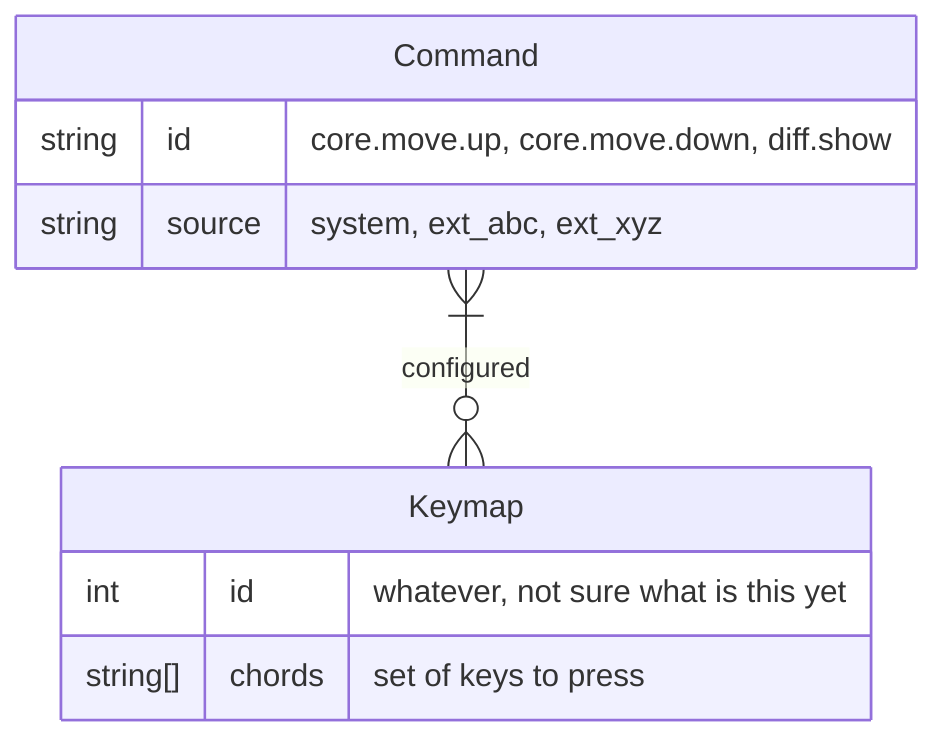
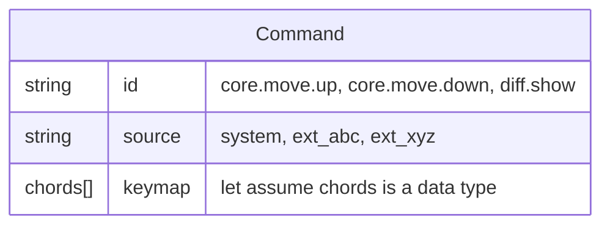
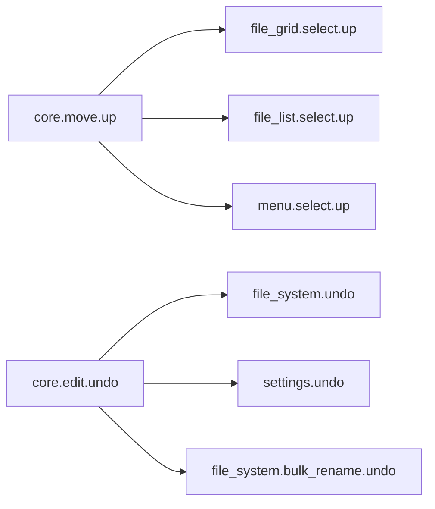
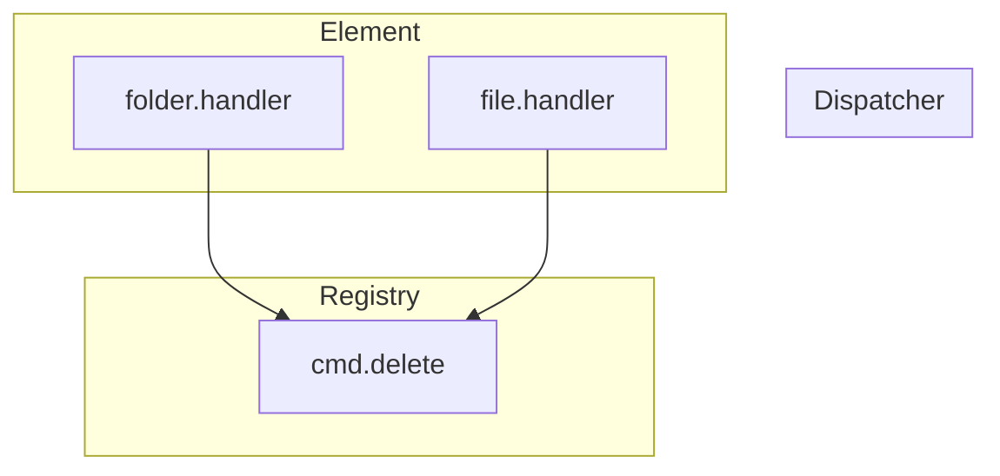

# Keymap

## About

This doc discuss the design of our keymapping system. The goal is to have
something like or even better than the keymapping system in JetBrains product.

- Keymaps have an inheritance structure, where changing the higher level would
  take effect for those lower level mapping. Thus, common movement mapping like
  up, down, left, right could be reconfigured only once.
- Support multiple chords, so that we can define a prefix chord (e.g. `^B` in
  tmux) for a group of related actions, and subsequence chords (1 or more) to
  trigger the actual action.
- Support key hint, like how `Spacemacs` show possible next chord.
- Allow to export and import keymap settings.

## Analysis

At the minimum, a keymap should have these data:

- `id`: e.g. `core.move.up`, `core.move.down`, `workbench.split.vertical`, ...
- `chords`: 1 or many key chords
- `handler`: a function that will run when the chords are completed.

`handler` is a function, thus, it can't be exported and stored in DB or file.
That means all the keymapping `id` should be hard-coded either in the main app
or those extensions.

What should be the `id`? I guess it should refer to a command that the app
supports. There will be more commands than number of configured keymaps. The
relationship between `command` and `keymap` would look like this.

- 1 command can have 0 or multiple keymaps configured.
- 1 keymap can be associated with 1 or more commands. Depends on the GUI context
  (which part is focused, what is the user doing), the keymap chords could
  trigger a different command.

Perhaps it's better to just use one table to store both command and its keymaps
(if any).

So that we can represent the tree hierarchy between keymap more nicely.

---

How data works?

- In code, every new command must be declared as hard-coded constants/values.
  They relationship must be declared that way.

  - How about dynamic commands?. E.g.:
    - Diff folder A and B, where A and B is currently open in split view,
    - Diff folder A (currently opened) and another folder (to be selected).

- When component come in to view, bind the command with a handler. Unbind when
  the component is destroyed.

- Alter keymap settings of a command by loading configuration from BE, or update
  its on the UI.

So, there are

- Static data: register command in code, available at build time, serves as
  default config for all available commands.
- Dynamic data: handler functions.

---

Keymapping, in my messy mind right now, includes these parts:

- Core lib: support for the command and keymaping system. Its core should
  contain:

  - Constants for key, code values.
  - Class, functions to work with the command system.

  It doesn't depends on React, but could offer some React specific features such
  as hooks, component to detect keybinding.

  Its basic features are done. We could refine it further and then open source
  it to look for feedback.

- App framework, or, the major user of the core lib.

> TODO (tai):

---

Problems:

**How to define a sensible commands structure?**

To reuse logic, behaviors should be in reusable component -> command belong to
those reusable component. E.g:

- Vertical list: should support up/down for `next`/`prev` commands.
- Horizontal list: should support left/right for `next`/`prev` commands.
- Tables: all up/down/left/right
- Tree: like lists, _depends_ on the tree looks, it's either up/down or
  left/right for nodes navigation.

To be user friendly (when searching, redefining keymap), and for extra keymaps
for those features that only belong to a **specific** component, behaviors would
be defined for them.

- File List view: this should support `mark`, `context_menu`...

- Some commands could be defined once (so that they will only have 1 shortcut),
  and will be handled differently depends on which one take it.
  - Context menu.
  - Run/debug **the thing in the context** (like Jetbrains)
  - Suggestions, hints for what can be done in this context (`alt+enter` in
    Jetbrains).

Let's think about the interaction between parts of the system:

- Data, model: settings, file, API response, ...
- View: How it looks, sound, ... on the screen. This is a collection of
  components.
- User inputs:
  - Pointing devices (mouse click, touch, ...) should be handled directly by the
    components.
  - Keyboard.

---

Currently we have a POC for the command and hierarchy system.

Now, we need to extend it to support Command Palette pattern. We already can do
that by showing the content of the registry. However, the result would be too
abstract.

If we have several editing commands like `edit.cut`, `edit.paste`, `edit.copy`
and `edit.delete`, and if we only have a general name and id of such commands,
the palette can not tell users what will happen if we execute `edit.delete`.

Also, let's say we have 2 panels, each with different items got focused, how
many `edit.delete` should the palette display? I would like it to show 2
different version of `edit.delete`, like:

- `Delete _folder ABC_ (left panel)`
- `Delete _2 selected folders and 5 selected files (right panel)`

Both Jetbrains and VScode command system can't support this use case. I guess
their design have the similar architecture with our, thus have a same limit.
**The `Registry` only know the general info about the command**. Only the
`Dispatcher` know the details.

We need to solve several issues:

1. Somehow probagate the cmd details from `Dispatcher` to `Registry`, while
   still maintain separation of concerns.
2. How to display or manipulate (reassign) shortcuts when showing that many
   version of Delete?

If we ignore (2) for now, and only show 1 version of `edit.delete`, then, the
last focused.

Term:

- CP: Command Palette
- R: Registry
- D: Dispatcher.
- E: Element
- Cmd

Notes:

- Command Palette (CP) should filter and display only those command with at
  least 1 handler, not all command.
- The handler knows about about the exec context for the attached command.
- Command Palette needs to be able to dispatch command. So, CP needs to use both
  R and D.
- We want to have only 1 global R for what?
- Why can't we have 1 global D?
  - There are many Es on the page, each can supports multiple Cmds. So if we
    have only 1 D, it'll be hard to find the correct handler. The current design
    of 1 D per E is simple and effective.
